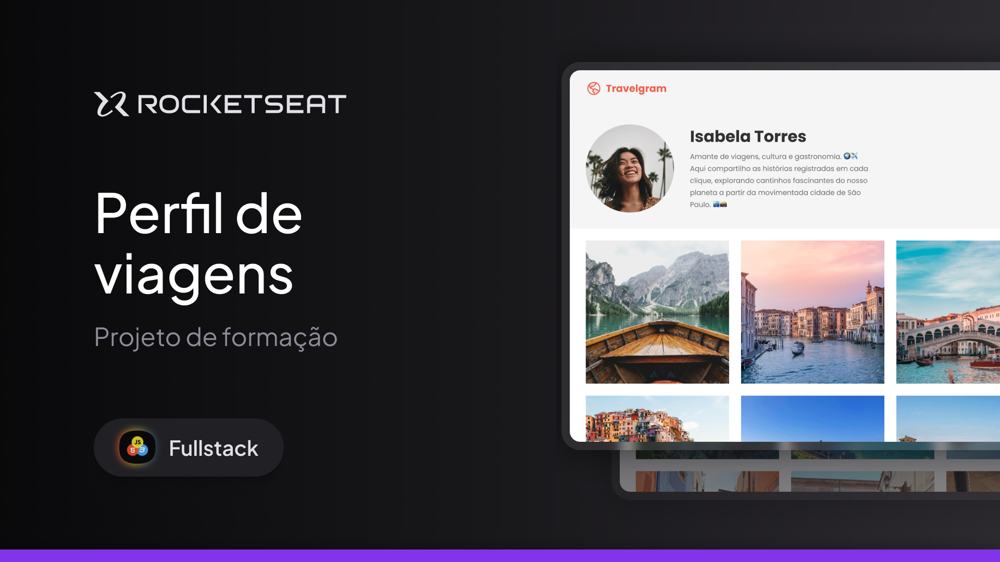

<h1 align="center">Travelgram </h1>

Boas-vindas ao projeto Perfil de viagens  
Programa exclusivo e gratuito, promovido pela Rocketseat para ensino de tecnologias WEB.  

  <a href="#-tecnologias">Tecnologias</a>&nbsp;&nbsp;&nbsp;|&nbsp;&nbsp;&nbsp;
  <a href="#-projeto">Projeto</a>&nbsp;&nbsp;&nbsp;|&nbsp;&nbsp;&nbsp;
  <a href="#memo-licença">Licença</a>

  

 

  

## 🚀 Tecnologias

Esse projeto foi desenvolvido com as seguintes tecnologias:

- HTML e CSS
- Git e Github
- Figma

## 💻 Projeto

Neste projeto crio o layout do perfil de uma rede social de fotos de viagem. 
Esse é um dos projetos desenvolvidos em aula na formação Full-stack.

## :memo: Licença

Esse projeto está sob a licença MIT.

---

Feito com ♥ by Paulo Nachava
